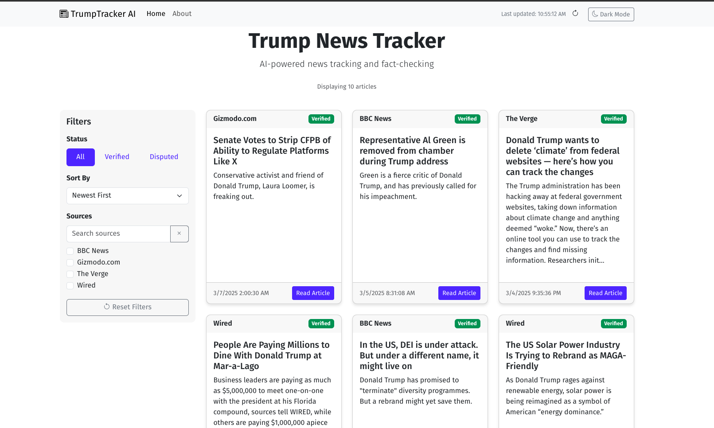
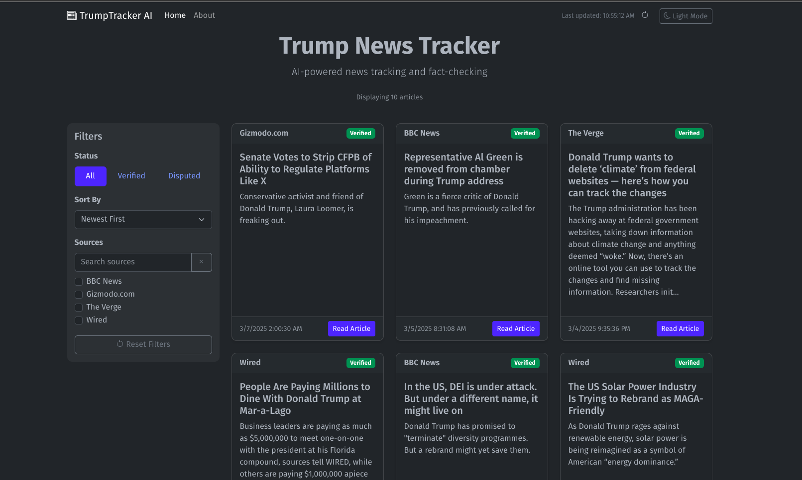

# TrumpTracker AI


AI-powered news tracking, fact-checking, and analysis for Trump-related coverage.

## 📰 About TrumpTracker AI

TrumpTracker AI is an intelligent news aggregation platform that automatically collects, analyzes, and fact-checks news articles related to Donald Trump. Using advanced AI and natural language processing, the platform filters through the noise of political coverage to deliver verified information and identify disputed claims.

## ✨ Key Features

- **Automated News Collection**: Continuously gathers relevant Trump news articles from multiple sources.
- **AI-Powered Fact-Checking**: Automatically identifies and verifies claims within articles.
- **Smart Summarization**: Creates concise summaries of articles using extractive summarization.
- **Claim Verification**: Labels articles as "Verified" or "Disputed" with detailed source information.
- **Responsive UI**: Modern, mobile-friendly interface with dark/light mode support.
- **Advanced Filtering**: Sort by relevance, date, source, and verification status.
- **Real-Time Updates**: Refreshes content automatically every 30 minutes.

## 🚀 Technologies

- **Backend**: Python, Flask, NLTK, Requests
- **Frontend**: HTML5, CSS3, JavaScript, Bootstrap 5
- **AI/ML**: Natural Language Processing, Extractive Summarization
- **APIs**: NewsAPI, Google Fact Check Tools API
- **Infrastructure**: Docker, Gunicorn, CORS

## 🛠️ Installation

### Prerequisites

- Python 3.10+
- Docker (optional)
- NewsAPI key
- Google Fact Check Tools API key

### Standard Installation

1. Clone the repository:
    ```sh
    git clone <repository-url>
    cd TrumpAi
    ```

2. Create and activate a virtual environment:
    ```sh
    python3 -m venv venv
    source venv/bin/activate
    ```

3. Install the required dependencies:
    ```sh
    pip install -r requirements.txt
    ```

4. Set up environment variables:
    - Create a `.env` file in the project root with the following content:
        ```properties
        NEWS_API_KEY=your_news_api_key_here
        FACT_CHECK_API_KEY=your_fact_check_api_key_here
        ```

5. Download necessary NLTK data:
    ```sh
    python -m nltk.downloader punkt stopwords
    ```

6. Run the application:
    ```sh
    python trump_news_agent.py
    ```

### Docker Installation

1. Build the Docker image:
    ```sh
    docker build -t trump-news-agent .
    ```

2. Run the container with your API keys:
    ```sh
    docker run -p 5000:5000 -e NEWS_API_KEY=your_key -e FACT_CHECK_API_KEY=your_key trump-news-agent
    ```
    Replace `your_key` with your actual API keys.

## 📋 Usage

- Access the web interface at `http://localhost:5000`.
- Browse through the latest Trump-related news articles.
- Use filters to sort by relevance, date, or source.
- View verification status and fact-check information for each article.
- Toggle between light and dark modes using the theme button.

## 🖼️ Screenshots


*Main dashboard showing Trump news articles with fact-checking information*


*The application in dark mode for comfortable nighttime viewing*


## 🔍 How It Works

1. **News Collection**: The system fetches articles from NewsAPI containing keywords related to Donald Trump.
2. **Filtering**: Articles are filtered for relevance based on content analysis.
3. **Summarization**: The NLP engine extracts key sentences to create concise summaries.
4. **Fact-Checking**: Claims are extracted and verified against trusted sources using the Google Fact Check Tools API.
5. **Classification**: Articles are labeled as "Verified" or "Disputed" based on fact-checking results.
6. **Presentation**: The processed articles are displayed in an intuitive web interface with filtering options.

## 🧩 Project Structure 

```
trumptracker-ai/
├── trump_news_agent.py   # Core news fetching and processing logic
├── trump_news_ui.py      # Web interface and API endpoints
├── trump_news.json       # Cached news data
├── requirements.txt      # Project dependencies
├── Dockerfile            # Container configuration
├── start.sh              # Startup script for Docker
├── assets/               # Static assets
│   └── images/           # Screenshots and images
└── frontend/             # Frontend web assets
    └── dist/             # Distribution-ready frontend files
        └── index.html    # Main HTML interface
```

## 📝 License

This project is licensed under the MIT License - see the LICENSE file for details.

## 🙏 Acknowledgments

- NewsAPI for providing access to diverse news sources.
- Google Fact Check Tools API for claim verification.
- NLTK community for natural language processing tools.
- Bootstrap team for responsive design components.

## 🤝 Contributing

Contributions are welcome! Please feel free to submit a Pull Request.

## 📬 Contact

For questions or support, please open an issue on this repository.

**TrumpTracker AI: Truth in Trump coverage, automatically verified**
